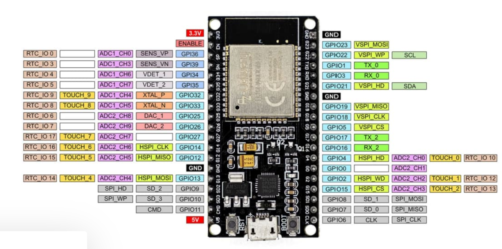
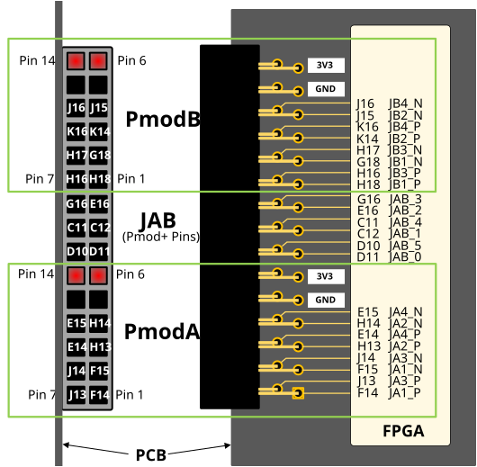
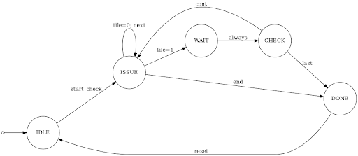
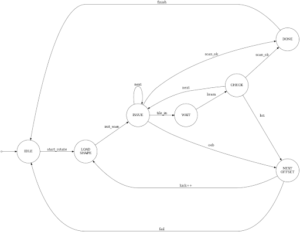
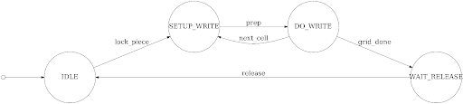

# Architecture

## Wireless Input and GPIO Bridge

Gamepad inputs are transmitted from the Dabble iOS app to the ESP32-WROOM-32 over Bluetooth. The ESP32 firmware maps each input to a 3.3 V GPIO output connected through a breadboard to an FPGA GPIO port.

Inside the FPGA, the asynchronous signals are synchronized and converted into clean action pulses. Additional input logic distinguishes individual presses from held buttons, allowing horizontal movement, rotation, and soft drop commands to repeat naturally.

<table>
  <tr>
    <td width="50%" align="center">
      
    </td>
    <td width="50%" align="center">
      
    </td>
  </tr>
  <tr>
    <td align="center">
      <em>ESP32 Bluetooth input and GPIO output path</em>
    </td>
    <td align="center">
      <em>FPGA GPIO connections for controller inputs</em>
    </td>
  </tr>
</table>

Exact mappings can be found towards the bottom of the constraints file in [`rtl/constraints/`](../rtl/constraints/).

## Architecture Overview

The 640 × 480 display is represented as a 40 × 30 grid of 16 × 16-pixel cells. The current game state is determined by the 8-bit value stored for each cell in a generated block RAM (BRAM) IP core configured for dual-port access. Game logic uses one BRAM port for board reads and writes, while the renderer independently reads from the second port for continuous video output. The playable Tetris well occupies a subregion of this display grid.

Locked pieces are written into BRAM, while the actively falling piece is rendered through a separate overlay path. This keeps the board state persistent while avoiding repeated BRAM writes whenever the active piece moves or rotates.

Each Tetris piece is represented by a 4 × 4 bit pattern stored in ROM, with separate patterns for each of its four rotation states. This fixed-size representation allows the same collision, rendering, and locking logic to work with every piece.

The VGA controller provides the timing and pixel-position information needed to draw the image one pixel at a time. The upper bits of the current pixel coordinates identify one of the display cells, allowing the renderer to read its 8-bit value from BRAM. If the active piece occupies that cell, its value is substituted for the stored BRAM value.

The resulting render value is passed to the color mapper, which selects a base color and brightens or darkens the edges of each cell to produce the shaded 3-D block appearance. The VGA-to-HDMI IP core combines the RGB output with the synchronization and active-video signals and encodes them into the differential HDMI output signals.

## Game Control

The central control FSM determines when the design should process player movement, apply gravity, rotate or lock a piece, clear completed rows, spawn the next piece, or enter the game-over state.

Operations requiring multiple BRAM accesses are handled by dedicated FSM-based modules. The control FSM starts one operation at a time and waits for its completion signal before continuing, preventing multiple modules from accessing the game-logic BRAM port simultaneously.

## Collision Checking

Before a piece moves left, right, or downward, the collision checker evaluates its proposed position against the playable boundary and the occupied cells stored in BRAM. The same process is used when a new piece is spawned. If the spawn position is blocked, the control FSM enters the game-over state.

  
   
  <em>Collision checker FSM used to validate piece movement and spawning.</em>

## Rotation Checking

When the player requests a rotation, the rotation checker selects the next 4 × 4 pattern and determines whether it overlaps the board boundary or a locked block. If the piece cannot rotate at its current position, the module tests nearby wall-kick offsets before rejecting the request.

  
   
  <em>Rotation checker FSM used to validate rotations and test wall-kick offsets.</em>

## Piece Locking and Row Clearing

When the active piece can no longer move downward, the piece-locking module writes its occupied cells into BRAM. The row-clearing module then checks the rows intersected by the newly locked piece and can clear up to four adjacent completed rows in one operation. Rows above each cleared row are shifted downward before the next piece is spawned.

  
   
  <em>Row-clearing FSM used to detect completed rows and shift the board downward.</em>

## Known Limitation

An occasional rotation request can be lost before it is accepted by the central control FSM. When this occurs, the active piece continues falling normally but does not rotate. This is harmless other than requiring the user to press the rotate button again.

A future revision could hold each rotation request until it is acknowledged by the control unit instead of relying on a single-cycle pulse.
