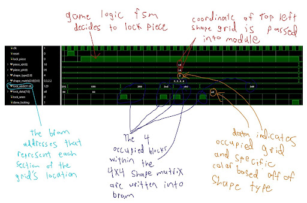
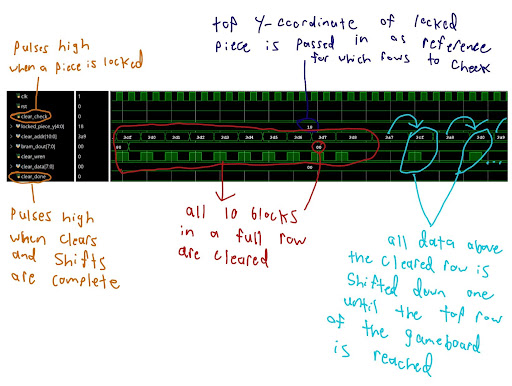

# Verification

## Simulation Waveforms and Testing

Several SystemVerilog testbenches were created to unit test individual modules. Each testbench supplied the inputs that would normally come from the central control FSM or top-level design and recorded the resulting module outputs.

Waveform simulation allowed module behavior to be verified independently before testing the complete system. This made debugging more efficient and reduced the need to regenerate the full FPGA bitstream after every design change.

## Piece-Locking Verification

The piece-locking testbench verified that the module correctly calculated the BRAM addresses and write data associated with the occupied cells of an active Tetris piece. The waveform was also used to confirm the expected write-enable and completion behavior during the locking process.

  
   
  <em>Simulated waveform used to verify the piece-locking module.</em>

## Row-Clearing Verification

The row-clearing testbench verified the sequence used to inspect completed rows, clear occupied cells, and shift the rows above them downward. The waveform allowed the BRAM address, write-enable, write-data, and completion signals to be examined throughout the operation.

  
   
  <em>Simulated waveform used to verify the row-clearing module.</em>

These module-level simulations helped isolate logic errors before the modules were integrated into the complete Tetris design. All testbenches used can be found in [`rtl/testbenches/`](../rtl/testbenches/).